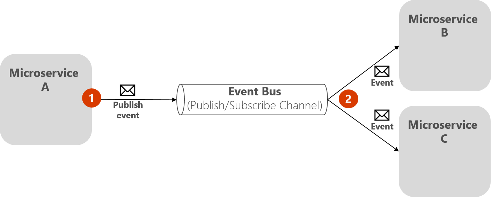
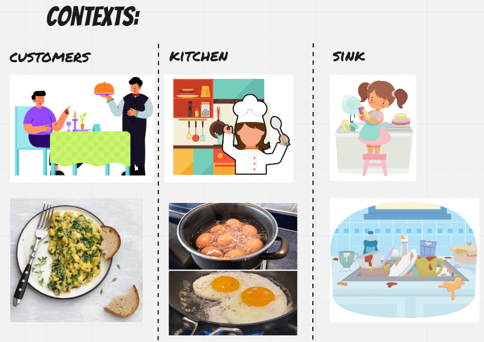

# Modular Monolith architecture 
###...in Egg Restaurant


## Architecture

This project is an example of Modular Monolith with Onion Architecture. Communication between the modules is implemented with events and Event Bus.
Onion Architecture is based on 3 layers:
* domain - bussines requirement
* application - frameworks, services, technology specific code
* infrastructure - other systems like DB, JMS, REST API


[source](https://blog.cleancoder.com/uncle-bob/2012/08/13/the-clean-architecture.html)

Domain is in the heart of software and with this approach we can achieve loosely coupling between modules.
If the business is mature then the domain module will stay unchanged. So when the framework became rusty and the team decide to change technology it will have no impact on business code. The same perfomance/integration changes.

### Monolith First!
The first step to deliver distributed system should be Modular Monolith, since Microservices requires much more infrastructure effort. Additionaly business domain must be stable because changes between the modules are difficult to implement.

## Event Bus
Event Bus is a subset of [Publish-Subscribe patterns](https://en.wikipedia.org/wiki/Publish%E2%80%93subscribe_pattern). It's a combination of [Observer](https://en.wikipedia.org/wiki/Observer_pattern) and [Mediator](https://en.wikipedia.org/wiki/Mediator_pattern#:~:text=In%20software%20engineering%2C%20the%20mediator,alter%20the%20program's%20running%20behavior.&text=This%20reduces%20the%20dependencies%20between%20communicating%20objects%2C%20thereby%20reducing%20coupling.) pattern. It's implementation can vary in other languages and frameworks, here's my Java example.

Event Bus is an architectural pattern it's used in distributed asynchronous architecture to create highly scalable reactive applications. It provides loosely coupling between different components. 


[Check Microsoft page](https://docs.microsoft.com/en-us/dotnet/architecture/microservices/multi-container-microservice-net-applications/integration-domainEvent-based-microservice-communications)

## Domain 


The domain is based on restaurant which serves eggs.

#### No Database

The project contains only InMemory Repository since it is used only for learning purposes. 

#### Modules
```java
├─┬ eggrestaurant
│ ├── commons
│ ├── cooking
│ ├── restaurant
│ └── wash
```

## Contexts
Domain is based on 3 subdomains since egg means something else for different actors.
* for customer egg means something to eat. 
* for cook it means an ingredient to make a meal.
* for dishwasher it means nothing else but ugly slush to wash...

